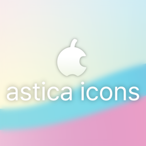

# Astica-icons

Astica icons is Mac-like icon pack for Linux.

The originate of name is Malus Asiatica which is Crab apple's scientific name.(Malus Asiatica -> Asiatica -> Astica)

Based on Qogir-icon-theme, WhiteSur icon theme.

## Used Fonts

* Mimetypes - Roboto, NanumSquare
* Apps - Google Sans, Noto Sans CJK, Noto Serif, NanumMyeongjo, Libertinus Serif

## Preview
